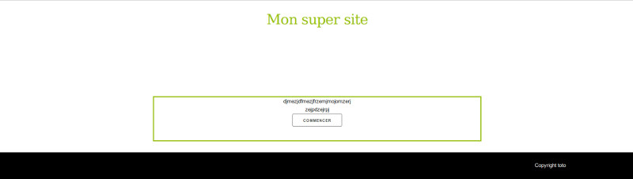

FastSubscriptionSiteGenerator
==============

License: [The MIT License](http://www.opensource.org/licenses/mit-license.php)

Copyright: 2016 jonathan COURBON jonathan.courbon@udamail.fr

***It's a learning project not a product. Use it at your own risk.***

Principle
------
Automatic generation of a subscription-like site
- Generate a single table within a database
- Generate the front-end for the visitor; possibilities: multiple steps forms, authentification
- Generate the back-end for the administrator with a table of all data

with the same philosophy as a CMS: a one-click installation

Requirements
------
- Website server: PHP with PDO extension
- Database: database hosted in MySQL server

Installation
------------

1. Download the package, copy the content of the folder FastSubscriptionSiteGenerator on your web server
2. Within a navigator, execute the script <yoururl>/Installation/fastSubscriptionSiteGenerator.php
4. Complete the fields; steps and fields are specified in a json format 
3. Complete the interface and click on "Generate website" button

The website is generated, enjoy and personnalize it: it is mainly HTML and CSS !

Libraries used
------------
Libraries are embedded
- Installation
-- JQuery and JQuery UI
-- Twig
- Front-end
-- JQuery and JQuery UI
- Back-end
-- JQuery and JQuery UI
-- DataTables: https://www.datatables.net/

Updates
------------
2016-04-29: add select box for choosing the number of entries

Snapshots
------------
### Installation #

### Front-end #

### Back-end #

